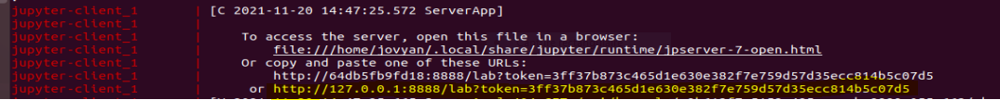
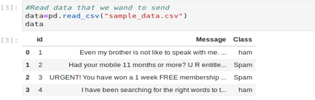
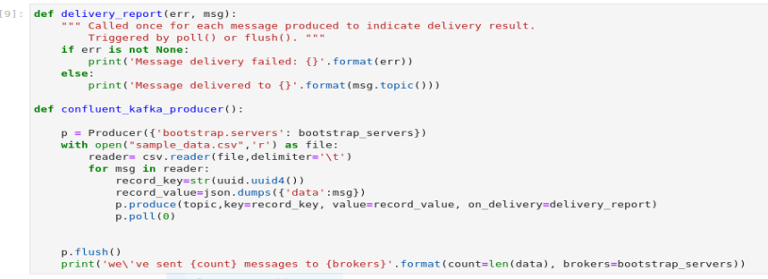
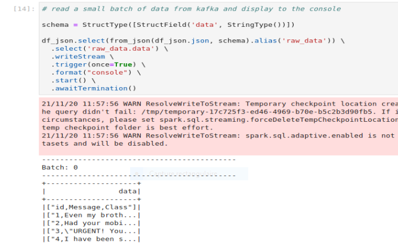

## Step 1: Create a Docker image for Spark/Jupyter
We will use a Jupyter notebook to run the python code of this repositry. That's why we will create a Docker image with the Jupyter and Spark installations.

1) Clone the GitHub repository to any computer where git and docker are installed.

```
git clone https://github.com/ghizlane-jetti/Kafka_Spark_Streaming.git
```

2) Build the docker instance using the commands below. The "-f docker/Dockerfile ." is needed to copy files from the repository into the image.
```
docker build -t demo-pyspark-notebook  -f docker/Dockerfile .
```
3) This docker build command runs a few minutes. When done, it will create an image called demo-pyspark-notebook which you can see by this command
```
docker image ls demo-pyspark-notebook
```
## Step 2: Docker Compose for running backend pipeline components
Start all the docker containers needed: the Kafka cluster, and the container for the Jupyter notebook and Spark
```
docker-compose up
```
This also takes a minute or more.

Kafka is a distributed streaming platform that can handle large volumes of messages. Messages flow from producers to consumers. Messages are organized into topics, and partitioned for parallel processing. Kafka runs on a cluster of one or more servers called brokers. Cluster resources are managed by a zookeeper. We will see that to read or write to a Kafka cluster, we need a broker address and a topic.
This docker-compose command starts zookeper on port `2181` , a kafka broker on port `9092`. The final Kafka component is another Docker container kafka-create-topic , which exists for the sole purpose of creating a topic (called test) in the Kafka broker.
The docker-compose command also starts the Jupyter notebook process. While Spark can also run in a multi-component cluster, In this case, we use a single container configuration.

## Step 3: Launch the Jupyter notebook

To run the notebook, you need a security code called a token. The `docker-compose` command in step 2 above launched the needed Jupyter notebook process, and displayed the security token during startup. However, this token is difficult to find amidst the volumes of log messages generated by Kafka and other processes.
To get the token, go to another command session and execute the command below. It restarts the container so that you can easily find the token.

```
docker restart kafkasparkstreaming_jupyter-client_1
```

In the docker-compose session, logging information is displayed. Find the URL (including the token), similar to the one shown below. Copy and paste the URL into your browser.



Go to the `work` folder and launch the notebook `spark_demo.ipynb`.

## Step 4: Initialization — Spark and Kafka

The first cell of the notebook imports libraries which we will use.

We  initialize pySpark using the findspark package:
```
import findspark
findspark.init()
```
The second cell establishes a connection between Spark and Kafka. 
Spark connects with Kafka using a `.jar` file that was installed when we created the Docker image demo-pyspark-notebook. The code below sets up references to this and other .jar files using an environment variable PYSPARK_SUBMIT_ARGS 
```
import os
os.environ['PYSPARK_SUBMIT_ARGS'] = "--packages=org.apache.spark:spark-sql-kafka-0-10_2.12:3.0.0 pyspark-shell"
```

## Step 5: Run the Kafka producer
In a production application, an external process could continuously write messages to Kafka. For this example, we want to write some data `sample_data.csv` to Kafka for later processing:



To implement the producer, we use the confluent_kafka library in python:


This procedure sends every line of data as message. Each message written to the queue requires a key. We generate a uuidkey, which is essentially random. This helps distribute data evenly to nodes of the cluster. In the end, we also run a flush command to ensure that all the messages are sent.
If the confluent_kafka_producer executes successfully, the pipeline will display a message stating that the data has been sent correctly:
```
we’ve sent 4 messages to kafka:9092
```
## Step 6: Read data from Kafka

We use Spark Structured Streaming to consume the data. Similar to Kafka, this could be a massively parallel, real-time process. Spark hides the complexities of this with an easy to use API. The code below loads micro batches of data into data frames. We first need to read the input data into a data frame:

```
df_raw = spark \
  .readStream \
  .format('kafka') \
  .option('kafka.bootstrap.servers', bootstrap_servers) \
  .option("startingOffsets", "earliest") \
  .option('subscribe', topic) \
  .load()
```
The `startingOffset` is set to `earliest`. This causes the pipeline to read all the data present in the queue, each time we run the code.
This input will contain a rich assortment of metrics from Kafka, such as keys, values, offsets, etc. We are only interested in the values, the actual data, so we run a transformation to reflect that:
```
df_json = df_raw.selectExpr('CAST(value AS STRING) as json')
```

After we run the cell below, our results display in the console. Because we are using the notebook, you will only be able to visualize it from the terminal you have started the Jupyter. The command trigger(once=True) , will only run the stream processing for a short period and show the output.



